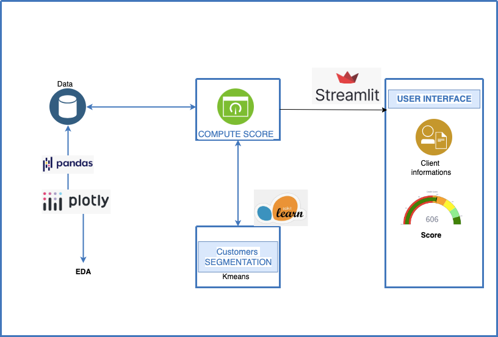

# Credit score and customer segmentation

## Overview

Credit scoring aims to determine the creditworthiness of individuals based on their credit profiles. By analyzing factors such as payment history, credit utilization ratio, and number of credit accounts, we can assign a credit score to each individual, providing a quantitative measure of their creditworthiness.

The process of calculating credit scores and segmenting customers based on their credit scores involves several steps. Firstly, relevant data about borrowers is collected and organized. Then, using complex algorithms and statistical models, the collected data is analyzed to generate credit scores for each borrower.

Once the credit scores are calculated, customers are segmented into different risk categories or credit tiers based on predefined thresholds.
This segmentation helps financial institutions assess the credit risk associated with each customer and make informed decisions regarding loan approvals, interest rates, and credit limits. By categorizing customers into segments, financial institutions can better manage their lending portfolios and effectively mitigate the risk of potential defaults.

## Architecture



## Dataset

The given dataset includes features such as age, gender, marital status, education level, employment status, credit utilization ratio, payment history, number of credit accounts, loan amount, interest rate, loan term, type of loan, and income level.

Below is the description of all the features in the data:

1. Age: This feature represents the age of the individual.
2. Gender: This feature captures the gender of the individual.
3. Marital Status: This feature denotes the marital status of the individual.
4. Education Level: This feature represents the highest level of education attained by the individual.
5. Employment Status: This feature indicates the current employment status of the individual.
6. Credit Utilization Ratio: This feature reflects the ratio of credit used by the individual compared to their total available credit limit.
7. Payment History: It represents the monthly net payment behaviour of each customer, taking into account factors such as on-time payments, late payments, missed payments, and defaults.
8. Number of Credit Accounts: It represents the count of active credit accounts the person holds.
9. Loan Amount: It indicates the monetary value of the loan.
10. Interest Rate: This feature represents the interest rate associated with the loan.
11. Loan Term: This feature denotes the duration or term of the loan.
12. Type of Loan: It includes categories like “Personal Loan,” “Auto Loan,” or potentially other types of loans.

## How to run the project

Clone the projet and run :

```bash
streamlit run app.py
```
